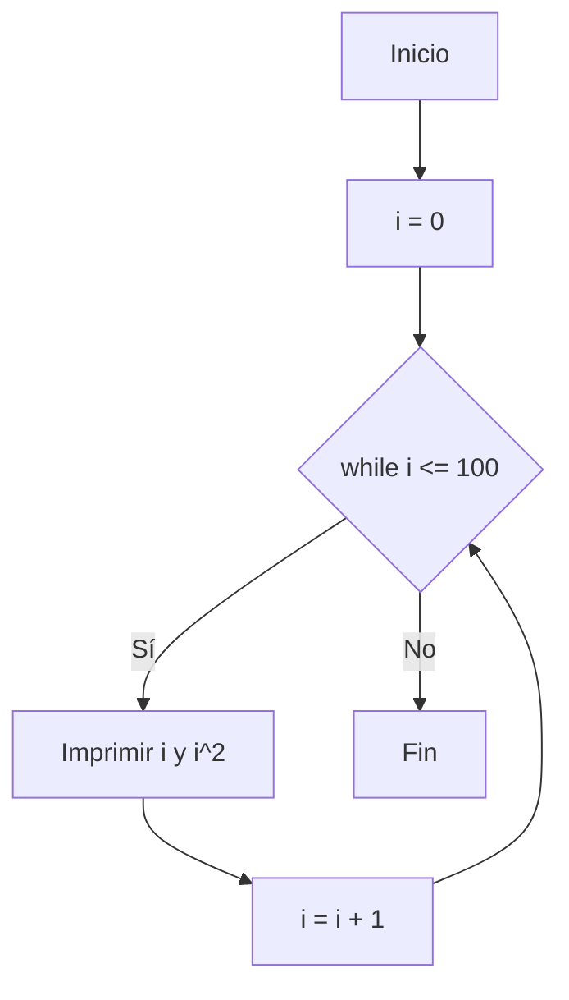
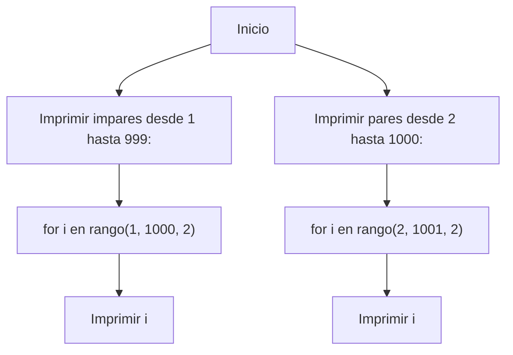
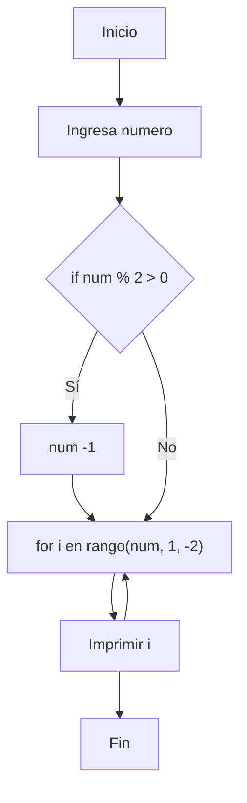

# Reto_06
---
**Nota:** Los ejercicios del 1-6 se encuentran en el notebook anexo a este repositorio

---
Diagramas de flujo de los puntos 1,2,3

**Diagrama de flujo - Punto 1**

---
**Diagrama de flujo - Punto 2**

---
**Diagrama de flujo - Punto 3**

